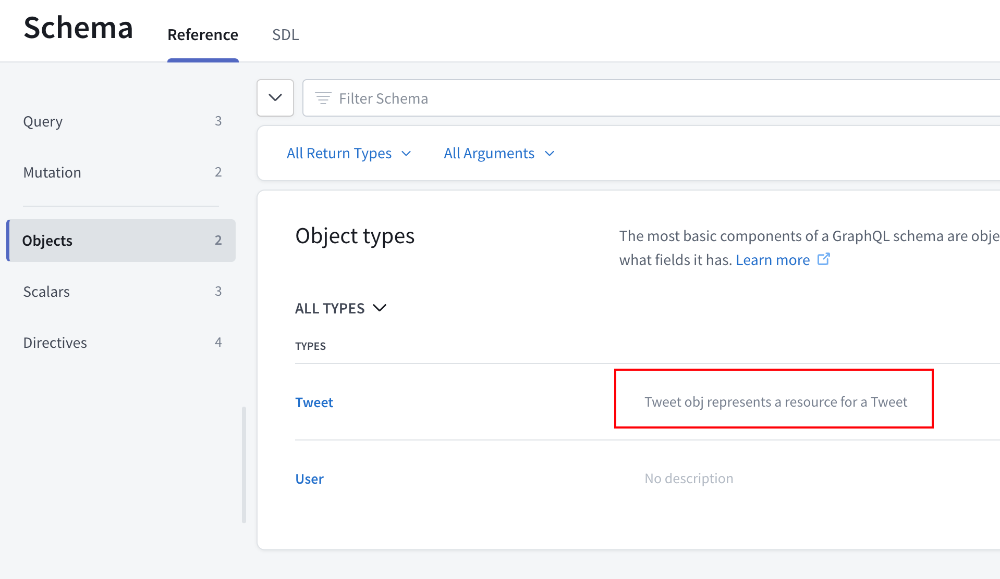

Apollo server 를 이용해 graphql 구현하기

## Setup

프로젝트 셋업

1. `mkdir [폴더명]` : 폴더를 만들어준다
2. code [폴더명] : vscode로 실행
3. npm init y : package.json 생성 (.gitignore파일을 만들어서 node_modules 추가)
4. "type": "module" 을 package.json 에 추가해준다. (import 문법을 쓰게 해줌)
5. npm i apollo-server graphql
6. npm i nodemon -D

```json
// package.json
{
  "name": "tweetql",
  "version": "1.0.0",
  "description": "",
  "main": "index.js",
  "scripts": {
    "dev": "nodemon server.js"
  },
  "keywords": [],
  "author": "",
  "license": "ISC",
  "dependencies": {
    "apollo-server": "^3.12.0",
    "graphql": "^16.6.0"
  },
  "devDependencies": {
    "nodemon": "^2.0.21"
  },
  "type": "module"
}
```

Query Type, Mutation Type 을 추가한다.

```js
import { ApolloServer, gql } from 'apollo-server';
const typeDefs = gql`
  type User {
    id: ID
    username: String
  }
  type Tweet {
    id: ID!
    text: String!
    author: User!
  }
  type Query {
    allTweets: [Tweet!]!
    tweet(id: ID!): Tweet!
  }
  type Mutation {
    postTweet(text: String!, userId: ID!): Tweet!
    deleteTweet(id: ID!): Boolean!
  }
`;
// GET /api/v1/tweets
// POST DELETE PUT /api/v1/tweets
// GET /api/v1/tweet/:id

const server = new ApolloServer({ typeDefs });

server.listen().then(({ url }) => {
  console.log(`Running on ${url}`);
});
```

- `type Query`을 gql 에 제공해야만 한다.
- 제공된 쿼리타입은 유저가 요청(GET)할 수 있는 데이터가 된다.
- `type Mutation` 을 제공하면 유저가 POST 할 수 있는 데이터가 된다.

```js
type Mutation {
    postTweet(text: String!, userId: ID!): Tweet!
    deleteTweet(id: ID!): Boolean!
  }
```

Operation

```js
mutation {
  postTweet(text:"Hello", userId:"1") {
    text
  }
}
```

## Non Nullable fields

> `!` 를 붙이는 의미는 Non-Nullable Field 임을 나타낸다

## Query resolver

- resolver 는 타입의 정의와 같은 형태를 가져야 한다.

```js
const tweets = [
  // fake db
  {
    id: '1',
    text: 'first one!',
  },
  {
    id: '2',
    text: 'second one',
  },
];

const resolvers = {
  Query: {
    // allTweet 를 호출할때 작동할 함수
    allTweets() {
      return tweets;
    },
    tweet(root, { id }) {
      return tweets.find((tweet) => tweet.id === id);
    },
  },
};
```

### mutation resolver

```js
const resolvers = {
  Query: {
    // Query resolver
  },
  Mutation: {
    postTweet(_, { text, userId }) {
      const newTweet = {
        id: tweets.length + 1,
        text,
      };
      tweets.push(newTweet);
      return newTweet;
    },
    deleteTweet(_, { id }) {
      const tweet = tweets.find((tweet) => tweet.id === id);
      if (!tweet) return false;
      tweets = tweets.filter((tweet) => tweet.id !== id);
      return true;
    },
  },
};
```

### root 와 args

첫번째 인자로 root 가 들어가고 두번째 인자로 args 가 들어간다.
args 는 객체이다

### resolver function

어떤 type 내부의 어떤 field 에서건 resolver function 을 만들 수 있다.

```js
let users = [
  {
    id: '1',
    firstName: 'A',
    lastName: 'B',
  },
  {
    id: '2',
    firstName: 'Z',
    lastName: 'X',
  },
];

const resolvers = {
  Query: {
    // query resolver
  },
  Mutation: {
    // mutation resolver
  },
  User: {
    fullName({ firstName, lastName }) {
      return `${firstName} ${lastName}`;
    },
  },
};
```

- `fullName` 은 `users DB`에 없는 `dynamic field` 이다.
- fullName 을 단순히 요청하면 에러가 난다.(DB에 없어서)
- fullName 에 대한 resolver 를 만들기 위해서는 아래와 같은 resolver 를 추가하면 된다:

```js
User: {
    fullName({ firstName, lastName }) {
      return `${firstName} ${lastName}`;
    },
  },
```

-fullName 을 호출하면 graphql 은 allUser resolver 를 우선 호출하고 그 뒤에 fullName resolver 를 호출한다.

## relationship

> sql에서 foreign key 로 join 을 하는 것처럼 데이터 간에 관계를 만들 수 있다.

서로 다른 테이블의 db 를 연결하자

Users 와 Tweets 를 연결하자

```js
let tweets = [
  {
    id: '1',
    text: 'first one!',
    userId: '2', // 추가
  },
  {
    id: '2',
    text: 'second one',
    userId: '1', // 추가
  },
];

const resolvers = {
  Query: {
    // query resolver
  },
  Mutation: {
    // mutation resolver
    postTweet(_, { text, userId }) {
      const newTweet = {
        id: tweets.length + 1,
        text,
        userId, // 추가
      };
      tweets.push(newTweet);
      return newTweet;
    },
  },
  User: {
    // user resolver
  },
  Tweet: {
    author({ userId }) {
      // 해야 될 걸 찾아서 리턴해준다.
      return users.find((user) => user.id === userId);
    },
  },
};
```


## Documentation

FE 와 협업을 하게 되면 Schema 에 대한 설명이 필요하다.

### Tweet object 에 대한 설명 추가하기

```js
  """
  Tweet obj represents a resource for a Tweet
  """
  type Tweet {
    id: ID!
    text: String!
    author: User
  }
```

위와 같이 설명할 대상 위에서 `"""` 로 설명을 감싸주면 된다.



## Migrating from REST to GraphQL

REST API 에서 GraphQL API 로 쉽게 바꿀 수도 있다.

1. REST API의 field 를 graphQL 스키마로 바꾼다.
2. Resolver를 만든다.
3.
